<!-- Google tag (gtag.js) -->
<script async src="https://www.googletagmanager.com/gtag/js?id=G-SJL6EQRW3V"></script>
<script>
  window.dataLayer = window.dataLayer || [];
  function gtag(){dataLayer.push(arguments);}
  gtag('js', new Date());

  gtag('config', 'G-SJL6EQRW3V');
</script>
<!-- _paginate: false -->

<style>
.image-credit {
  color: #666;
  font-size: 0.4em;
  line-height: 1.3;
  margin-top: 0.4em;
  text-align: right;
}
.footnote-link {
  color: #666;
  font-size: 0.42em;
  line-height: 1.3;
  margin-top: 1.2em;
}
</style>

# AI 世代，有了 Harness，還需要軟體工程嗎？

<br />
<br />
<br />

## Denny Huang
### 2026/06/18

---


# [https://denny.one/Harness-Engineering/](https://denny.one/Harness-Engineering/)

---

# Denny Huang

- <a href="https://sitcon.org/" target="_blank">SITCON 學生計算機年會</a> 共同發起人
- <a href="https://coscup.org/" target="_blank">COSCUP 開源人年會</a> 長期志工
- <a href="https://hitcon.org/" target="_blank">HITCON 台灣駭客年會</a>  長期志工
- GDG Cloud Taipei Organizer
- 曾任雷亞遊戲（Rayark Inc.） 資料分析團隊主管
- <a href="https://denny.one/" target="_blank">About me</a>

---

# 教學生軟體開發生命週期？
## [SITCON 夏令營 2026](https://sitcon.camp/2026/)
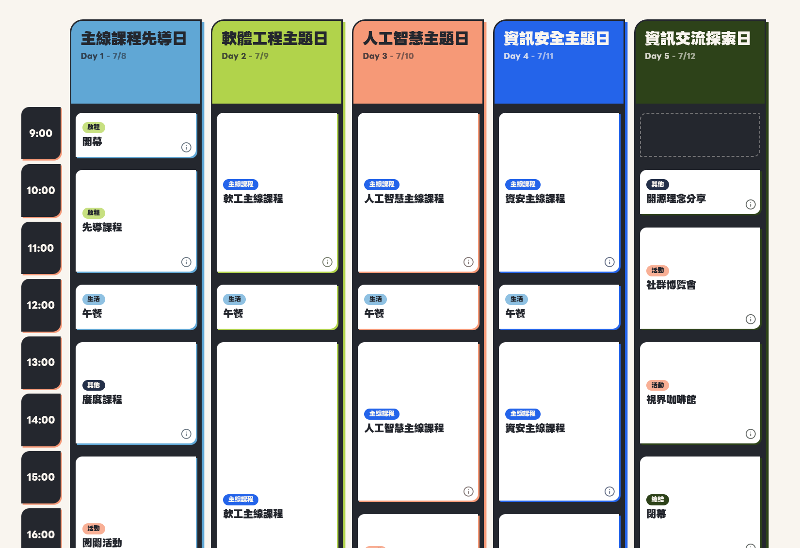

---

# 過去的軟體工程課程
- 學習者技術能力有限，無法參與真實專案
- 照本宣科
- UML 畫到飽
- 專注於文件產出，難以理解文件的使用者和目的
- 難以重現真實專案的規模、演化與人際協作

---

# AI 時代怎麼教？
- 只給痛點，用 Coding Agent 直接開工，體驗沒有軟體工程方法的混沌
- 引導學生反思過程，從而認識軟體工程方法的價值
- AI 如何在各軟體開發生命週期中發揮作用
- 完成開發，繼續添加需求，體驗軟體的演化
- 組別交換專案，繼續添加功能；體驗軟體專案的人際協作
- [課堂成果報告](https://denny.one/SITCON-Camp-2026-SE/report/)

---

# 實際 Agentic Coding，體驗到軟體工程方法的價值

---

# 真實的痛點
身為活動主辦者，尋找合適照片非常費時費心
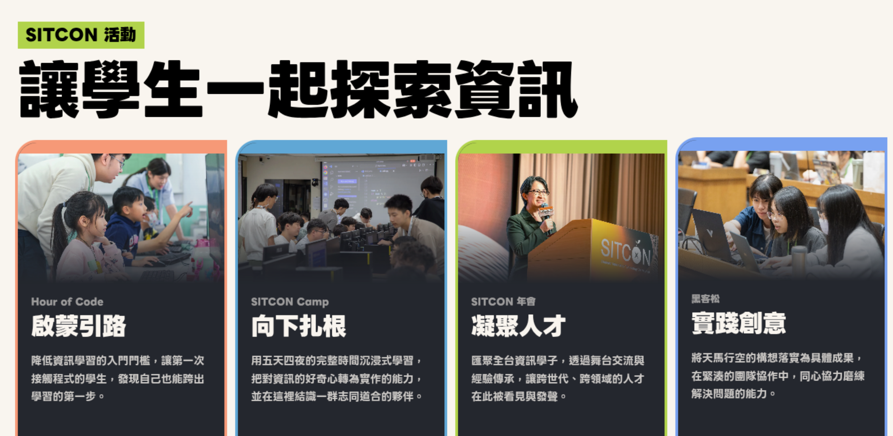

---

# 使用情境：志工招募貼文
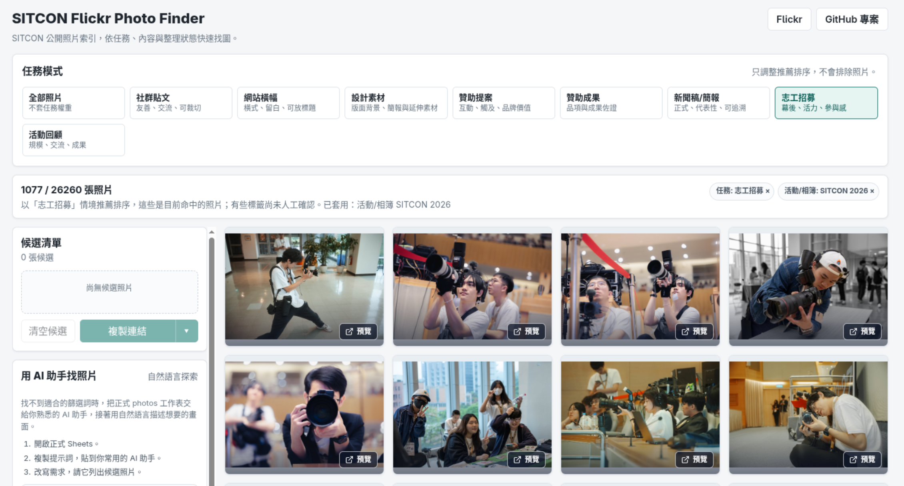

---

# 使用情境：展示會議廳空間
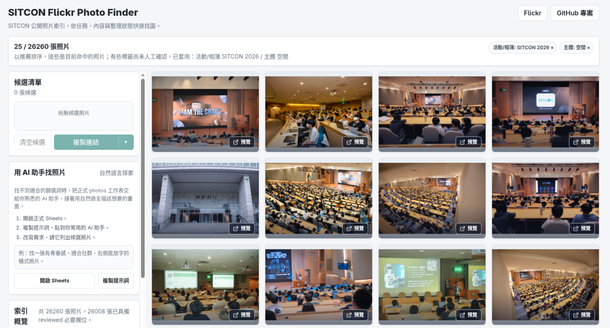

---

# 使用情境：[可分享連結](https://sitcon.org/flickr-photo-finder/?sort=people-asc&selected=25078675068%2C34239692452%2C34356401176)利於挑選照片討論
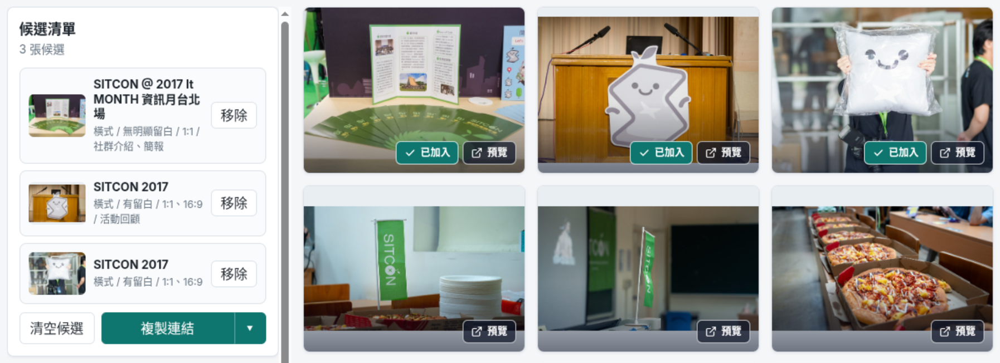

---

# [SITCON Flickr Photo Finder](https://sitcon.org/flickr-photo-finder/)
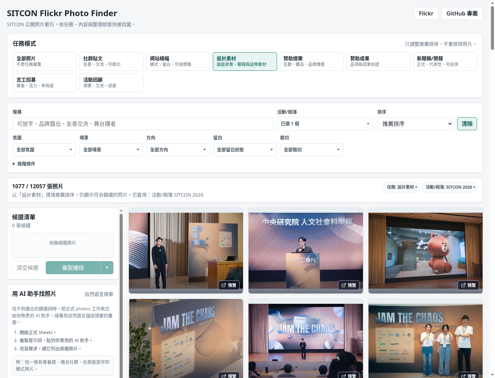 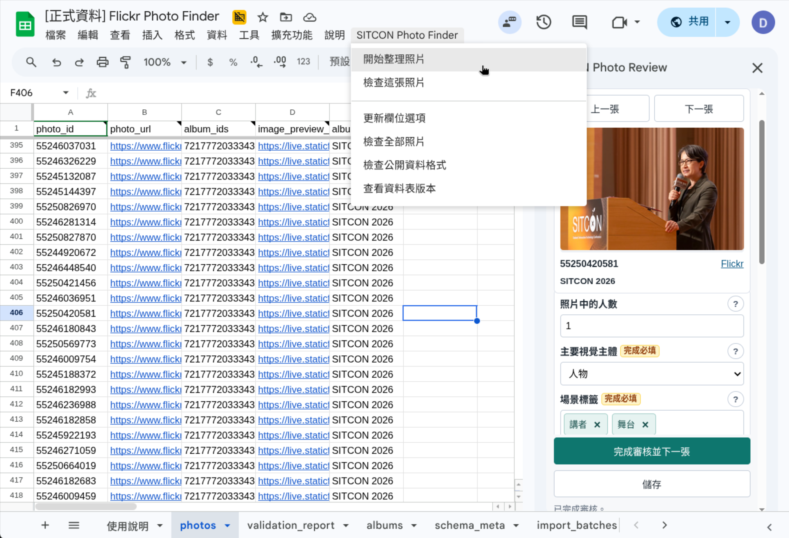

---

# 由 AI 標記照片
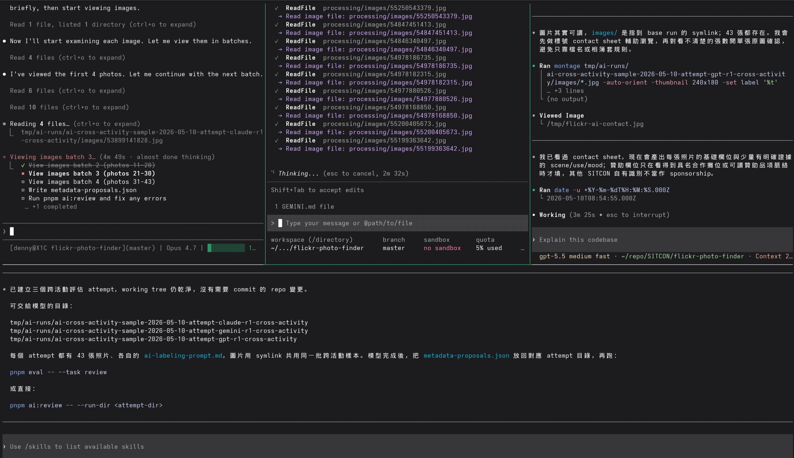

---

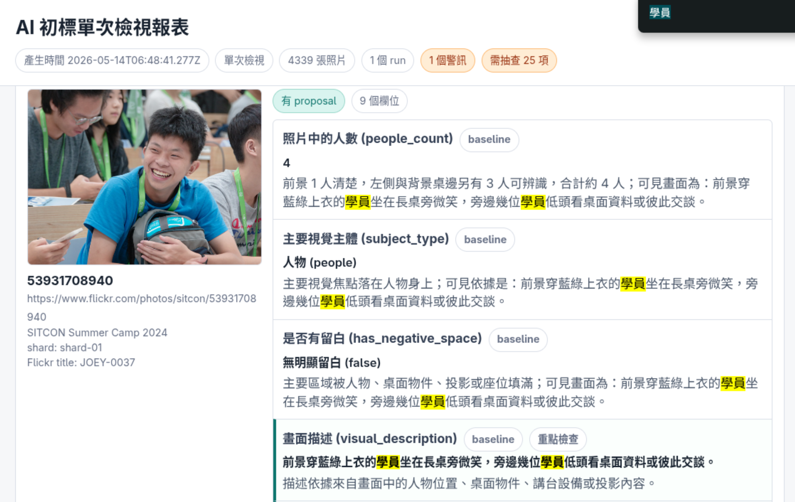

---

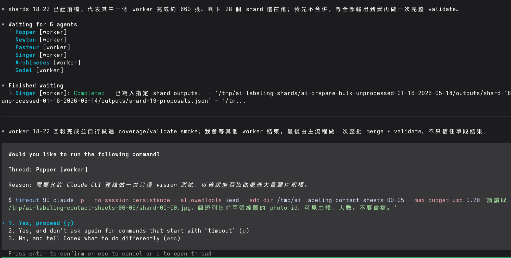


---

# 軟體開發生命週期（SDLC）
- Request and Analysis Phase（需求與分析階段）
- Design Phase（設計階段）
- Coding Phase （撰寫階段）
- Testing Phase（測試階段）
- Maintenance Phase （維護階段）

---

# DevOps Infinity Loop
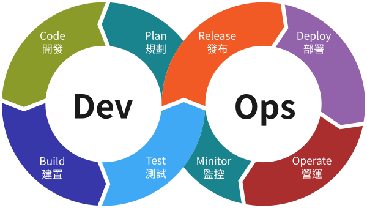
<p class="image-credit">改作自 <a href="https://commons.wikimedia.org/wiki/File:Devops-toolchain.svg" target="_blank"><em>Devops-toolchain.svg</em></a>，原作者 Kharnagy，來源 Wikimedia Commons，採 <a href="https://creativecommons.org/licenses/by-sa/4.0/deed.zh-hant" target="_blank">CC BY-SA 4.0</a> 授權；由 Denny Huang 修改並翻譯，本改作同樣採 CC BY-SA 4.0。</p>

---

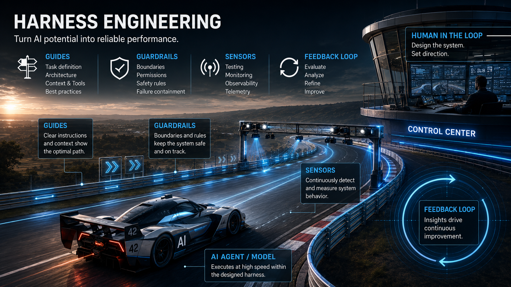

---

# [專案開發狀況](./git-growth-report.html)
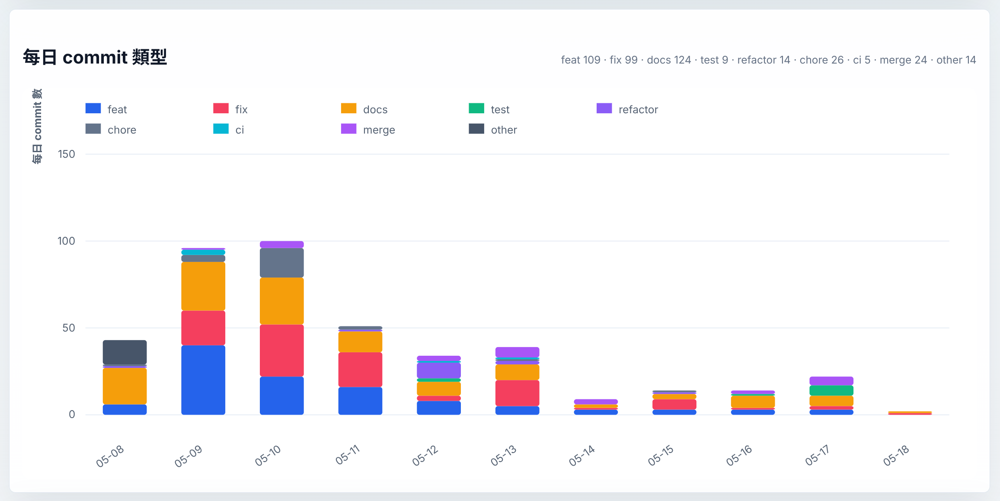

---

# Continuous Integration 持續整合

把軟體生命週期中的「應該要做」變成可重複的回饋機制

---

## CI 不只是 Testing

CI 常被理解成：

- push code
- run tests
- deploy

但在 AI Native 開發中，CI 更像是跨階段的 Harness：

> 把人的判斷、AI 的產出、系統的邊界，轉成可檢查的工程契約。

---

## 從五階段看 CI Harness

| SDLC 階段 | Harness 問題 |
| --- | --- |
| Request and Analysis | 我們還在解同一個問題嗎？ |
| Design | 邊界與契約還成立嗎？ |
| Coding | 新變更能被穩定接住嗎？ |
| Testing | 產出能被使用與採用嗎？ |
| Maintenance | 未來的人能安全延續嗎？ |

<p class="footnote-link">延伸閱讀：<a href="https://github.com/sitcon-tw/flickr-photo-finder/blob/master/scripts/commands/project-check.mjs" target="_blank">project-check.mjs</a></p>

---

## Request and Analysis Phase 需求與分析階段

需求階段的 Harness，不是幫你寫需求。

它是在保護「問題定義」：

- 文件入口沒有漂移，文件是給對的閱讀者
    - AGENTS.md
    - README.md
    - docs/
- 用語沒有模糊化
- 重要決策有位置可追蹤
- 後來的人知道當初為什麼這樣做
    - ADR 架構決策記錄（Architectural Decision Records）

---

## Tips：找 sub-agents 做使用者訪談
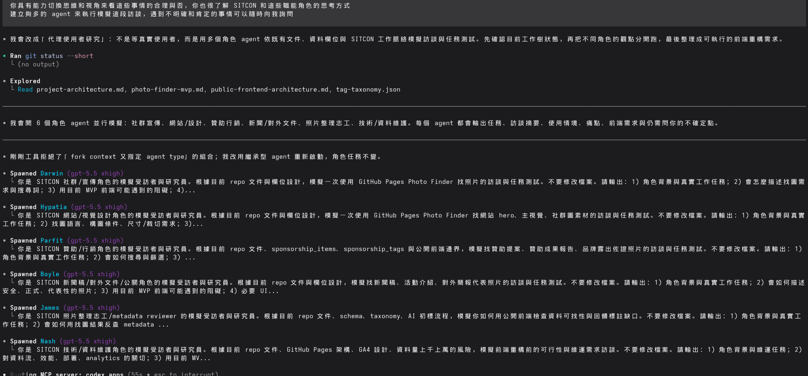

---

## Design Phase 設計階段

設計階段的 Harness，是把架構判斷變成可檢查邊界。

| 設計問題 | Harness 形式 |
| --- | --- |
| 誰是資料權威？ | schema / validation |
| 哪些值跨模組共用？ | shared value governance |
| 哪些東西可以部署？ | artifact boundary |
| 哪些行為不能放到公開端？ | permission / runtime boundary |

---

## Tips：善用 Mermaid 建立流程圖，幫助人類與 AI 共同理解

```
flowchart LR
  Flickr[Flickr<br/>照片與相簿來源]
  Sheets[Google Sheets<br/>正式照片索引]
  AppsScript[Apps Script<br/>Sheets 內維護輔助]
  Pages[公開搜尋前端<br/>唯讀找圖介面]
  AI[AI 助手與 agent<br/>找圖與標記候選]
  Users[籌備團隊與公開使用者]

  subgraph Project[這個專案提供的能力]
    Rules[資料規則<br/>schema / taxonomy / 欄位文件]
    Intake[匯入與同步工具<br/>相簿盤點 / intake / validation]
    Interfaces[使用介面原始碼<br/>GitHub Pages / Apps Script]
    AIGuide[AI 輔助流程<br/>prompt / run artifact / report]
  end

  Flickr -->|相簿與照片 metadata| Intake
  Rules --> Intake
  Intake -->|候選列與同步計畫| Sheets
  Interfaces -->|clasp deploy| AppsScript
  Interfaces -->|GitHub Actions artifact| Pages
  Rules --> AppsScript
  AppsScript -->|提示與校對| Sheets
  Sheets -->|build-time 公開 CSV / static artifact| Pages
  Sheets -->|公開 photos CSV / Sheet| AI
  AIGuide -->|輸入規則與報表| AI
  AI -->|找圖建議或候選標註| Users
  Pages -->|搜尋與篩選| Users
  Users -->|確認後編輯| Sheets
```

---

## Tips：善用 Mermaid 建立流程圖，幫助人類與 AI 共同理解

---

## Coding Phase 撰寫階段

讓變更進入系統時不靠個人環境運氣。

- 固定執行環境
- 固定套件管理工具
- 固定依賴版本解析
- 先抓語法錯誤與載入階段錯誤
- CLI 至少要能說明自己怎麼使用

---

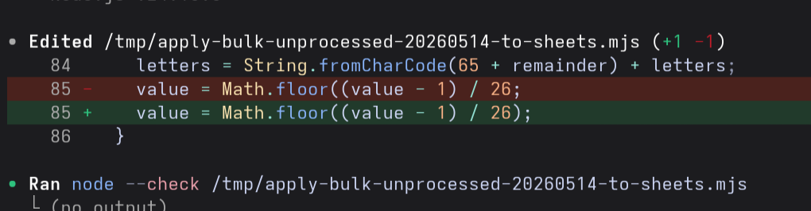

---

## Testing Phase 測試階段

有了 AI 後，測試更像是在替產出建立「採用邊界」：

| Harness 問題 | 這個專案中的意義 |
| --- | --- |
| 這份資料能不能被系統理解？ | 有資料格式規則與受控字彙 |
| AI 產出的候選能不能進入人工審查？ | 有品質關卡與審查警訊 |
| 哪些檢查不該自動跑？ | 需要權限、會寫入遠端、成本高的流程要停下來 |

好的測試 Harness 會同時定義：什麼可以自動通過，什麼必須停下來讓人判斷。

---

## 案例：統計方法抓出不合理的照片中人數

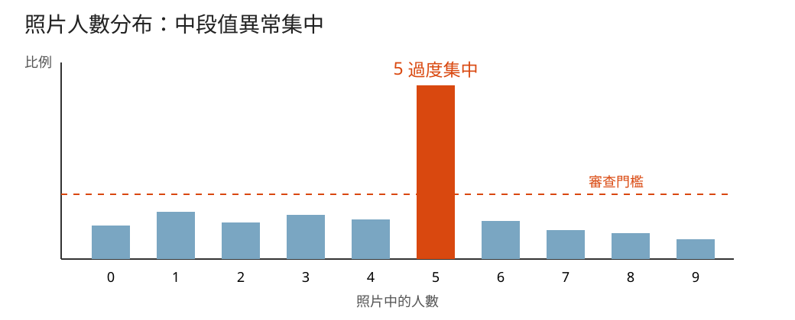

---

## 從統計訊號到審查行動

| 統計訊號 | Harness 反應 |
| --- | --- |
| 整批中段值異常集中 | 懷疑偷懶或模板化判斷 |
| 某相簿特別集中 | 優先抽查該使用情境 |
| 某批標記特別集中 | 檢查標記方式是否偏掉 |
| 異常群已定位 | 產生優先審查清單給人工確認 |

---

## Maintenance Phase 維護階段

維護階段的 Harness，是把未來會反覆發生的維護行為流程化。

| 維護行為 | Harness 化之後 |
| --- | --- |
| 依賴更新 | 有固定節奏，而不是想起來才做 |
| 變更合併 | 先驗證，再進主線 |
| 正式寫入 | 試跑、審查、寫入分離 |
| 權限交接 | 有清單、驗證順序與疑難排解入口 |

---

# 所以 AI 時代還要教 SDLC 嗎？

要，而且更需要。
因為 AI 讓產出變快，也讓判斷、邊界、交接、驗證變得更重要。

---

# 課程結束，實際效果如何？

- [成果報告](https://denny.one/SITCON-Camp-2026-SE/report/)
- [學員成果](https://sitcon-camp-2026.github.io/t3-m4-se-disaster/)
- [投影片](https://denny.one/SITCON-Camp-2026-SE/)
- [專案起始頁](https://sitcon.org/camp2026-se-disaster-starter/)

---

# Q & A

---

# Thanks for listening

<br />
<br />

###### 本投影片採用
 <a href="https://creativecommons.org/licenses/by-sa/4.0/deed.zh-hant" target="_blank">創用 CC「姓名標示-相同方式分享 4.0 國際」授權條款</a>釋出
 <a href="https://marp.app/" target="_blank">Marp</a> 製作
